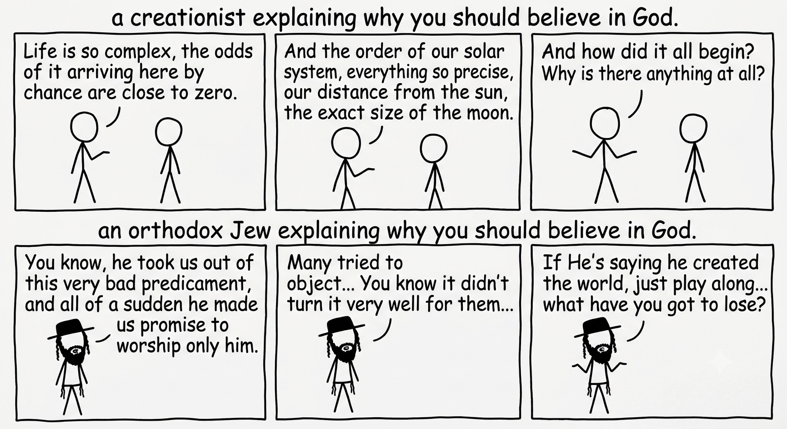

# The War That Was Never Against Anyone

For a few hundred years now, science has been winning a fight that never happened.

The story everyone knows goes like this. Once, religion explained the world. Lightning was God's anger, plague was His judgment, the sun crossed the sky because that was the route God set for it. Then science arrived with better explanations and took the territory back, one field at a time, until religion was left holding only the gaps. That shrinking set of things we still cannot account for. God of the gaps. And the gaps keep closing.

It is a nice story. It is also a category error in the first sentence.

## Religion doesn't explain. It asserts.

When you look at it honestly, a religion is not in the business of physical explanation at all. The Jewish claim is not "here is a mechanism for lightning." It believes in divine providence, so it says that behind the lightning there is a *divine will*. And behind the making of the world too. It is not occupied with the "how," it is occupied with the "why." Not with how the hand of providence moves through the world, but with what the one moving the hand wants.

The reason to believe is not that God made the world. The reason is a covenant. A contract. We were slaves in Egypt. Moses prophesied as God's messenger, and everything that came out of his mouth came to pass, one for one. After ten plagues, after which the sea split, Moses took us out of Egypt. We received a Torah at Sinai, and the message was plain: I saved you, you are now my people, here are the terms. That is not a hypothesis competing with thermodynamics. It is testimony, and a deal struck on the strength of it.

Notice what I am not doing. I am not fighting evolution, and I am not fighting the big bang. Maybe they happened, maybe they did not; I have no stake in the mechanism either way. What certainly happened is that we came out of Egypt. You can hand me the most complete physics in the world, finished to the last decimal, and it does not move that by an inch, because it was never the question.

You cannot beat a religious assertion with a better explanation, because they are not the same *kind* of move. It is like answering a legal argument with literary analysis. The Torah asserts that God created the world, on the strength of His having *proved that He controls all of it* with the wonders He worked in Egypt. Not on the strength of its sounding more reasonable. It does not.

## But what about what's written in Genesis?

Here comes the obvious objection. Fine, maybe religion does not explain lightning. But Genesis 1 does explain. Six days of creation, the order of things, where it all came from. Is that not a scientific account competing with science?

I will say at the outset: it was **never claimed**, not in the Torah itself, and not by its commentators early or late, that the Torah presumes to present a cosmological account, or a description of how life formed on earth. There were indeed commentators who tried to reconcile the verses with science, but that was an **interpretive attempt**, not a binding assertion. In Judaism, the Mishnah and Gemara **bind**. The rest may be expounded. There is no source in the words of the Sages that says, "the Torah described the unfolding formation of the stars, and the arrival of life on earth." There is only a source that says the **opposite**.

So let us look at the verses, because this is what confuses a lot of people.

But first a preface. When a person reads the verses, there is a natural tendency to start rationalizing how maybe the verses *do* intend a physical description. The human mind is powerful and creative, but it will be plain from the verses that we would need *strenuous work* to "dress" the verses in clothing that is not theirs. To force them to be what they clearly are not. And that means, in effect, that the interpreter, without noticing, has built himself a physical straw man, which he then believes he is fending off after the reading.

You could also read the Torah and come away with the impression that it suffers from *ignorance*, and so there is grounds here to challenge whether it is divine. But the argument is ridiculous. Ignorance of what? Of something the Torah never presumed to be expert in? The Torah is also "ignorant" of everything to do with reflexology. What does that mean? It is again that same famous straw man. You take non-physical claims, dress them in physics, and then claim ignorance.

And even if we grant it, the whole discussion is silly. Belief, as we wrote, does not rest on this. Even if the Torah is ignorant, or not clever enough, it makes no difference whatsoever. Even if Genesis 1 really did describe a primitive scientific theory that has been disproved, the Jewish people would still not be exempt from it. God would come and say, "True, that really is how I ran things once, but I have made a few upgrades since." Or, "True, I put that in to confuse you." It makes no difference. *The moment* God took us out of Egypt, none of that applies. If someone proved to you that he is the one fit to be your manager, and you signed a contract with him, and at the top of the contract he wrote a few wrong things about gravity, the contract is still **binding**. The exodus still happened.

## Analysis (slightly cynical) of the verses

Let us look at the verses. I am going to be a bit cynical, so bear with me a little:

**1** In the beginning God created the heavens and the earth.
**2** And the earth was formless and void, and darkness was over the face of the deep; and the spirit of God hovered over the face of the waters.

Deep? Water? Darkness? What is the deep? The earth was formless? What does that mean? Why is there darkness, which is somehow over the face of a deep. Oh, and the spirit of God hovers over the face of the waters. The spirit of God... is that even a physical concept? I wonder how it hovered, maybe it was with air pressure... and where did the water come from? Fine, let's keep going.

**3** And God said, let there be light; and there was light.
**4** And God saw the light, that it was good; and God separated between the light and the darkness.

What does it mean to separate between the light and the darkness? Light and darkness are two different things to begin with. Is there a claim here that could even be considered physical? Or even understood in our terms? And what does it mean to see the light, that it was good? Did He see that the speed of light is fast enough? Is that even a sentence with any physical meaning?

**5** And God called the light day, and the darkness He called night; and there was evening and there was morning, one day.

Wait, the sun and the moon were only created on the fourth day... day? night? one day? What are we even talking about here? Every person living on this earth knows that day and night without sun and moon are meaningless. At least not a meaning *we* understand. So why would anyone write something so meaningless? Fine, let's keep going, maybe we'll find the theory of relativity here by accident.

**6** And God said, let there be a firmament in the midst of the waters, and let it separate between water and water.

What is a firmament? Fine, it's some kind of thing that separates between water and water. Maybe here we'll manage to find some physical claim?

**7** And God made the firmament, and separated between the waters under the firmament and the waters above the firmament; and it was so.

Fine, God already said let there be a firmament (let there in Hebrew means being). Why is He now *making* it? Didn't it already come to be? And why does He again need to say "and it was so"?

**8** And God called the firmament heaven; and there was evening and there was morning, a second day.

What? The heaven that was created "in the beginning" on the first day? Is that our heaven? Where is the water in this whole story? Why would anyone write about water above the firmament, when it's clear to any person who has lived here a minute that there is no such thing? And why are we again being told there's a day, when the sun and moon haven't been created yet.

**9** And God said, let the waters under the heaven be gathered to one place, and let the dry land appear; and it was so.

Fine, that sounds a little reasonable. Waters gather. The dry land appears.

**10** And God called the dry land earth, and the gathering of the waters He called seas; and God saw that it was good.

Okay, why is it important that He calls the dry land earth? And why is it important that He called the gathering of the waters seas? Is there a physical claim here? What does it even mean? And what does it mean that He sees it's good? Why is it important to say that? Does all of this have some physical meaning?

**11** And God said, let the earth sprout grass, herb yielding seed, fruit tree producing fruit after its kind, whose seed is in it, upon the earth; and it was so.

Fine, that sounds a little physical.

**12** And the earth brought forth grass, herb yielding seed after its kind, and tree producing fruit whose seed is in it, after its kind; and God saw that it was good.

Well, didn't they already say this? If this were a physics book, I think they would delete this line. Besides that the tree is no longer a fruit tree. It's just a tree. Okay, I don't understand what this means. And why earlier did it produce fruit after its kind, and now not? And why again do I care that God sees it's good? What, He did something, and only afterward checked whether it was good? Enough, I don't understand a thing.

**13** And there was evening and there was morning, a third day.

Great. Another day without sun.

**14** And God said, let there be lights in the firmament of the heaven, to separate between the day and the night; and let them be for signs and for seasons, and for days and years.

Okay. Good thing we remembered.

**15** And let them be for lights in the firmament of the heaven, to give light upon the earth; and it was so.

Only now does it give light upon the earth? Before this everyone was in the dark?

**16** And God made the two great lights: the greater light to rule the day, and the lesser light to rule the night, and the stars.

Fine, after they came to be, now He again *makes* them. Why do you need to make something after it already came to be.

**17** And God set them in the firmament of the heaven, to give light upon the earth.

Fine, after He makes them, He also has to set them. Why, were they in a warehouse before that?

**18** And to rule over the day and over the night, and to separate between the light and the darkness; and God saw that it was good.

Fine, this is already strange. Again to separate between the light and the darkness. Didn't He already do that on the first day? And what does it even mean to separate between light and darkness? And didn't He already see that it was good? Oh, now it's the lights too.

**19** And there was evening and there was morning, a fourth day.

Fine, first time this somehow makes sense.

**20** And God said, let the waters swarm with swarms of living creatures, and let birds fly over the earth, across the face of the firmament of the heaven.

Fine, sounds reasonable. Except for that firmament.

**21** And God created the great sea creatures, and every living creature that creeps, with which the waters swarmed, after their kind, and every winged bird after its kind; and God saw that it was good.

Lucky He saw that it was good.

**22** And God blessed them, saying, be fruitful and multiply, and fill the waters in the seas, and let the birds multiply on the earth.

Very physical.

**23** And there was evening and there was morning, a fifth day.

Well, at least the crocodiles had lights.

**24** And God said, let the earth bring forth living creatures after their kind, cattle and creeping things and beasts of the earth after their kind; and it was so.
**25** And God made the beasts of the earth after their kind, and the cattle after their kind, and every creeping thing of the ground after its kind; and God saw that it was good.

**Again.** There are animals. And for some reason God needs to make them after they already came to be. This does not make sense in any way.

**26** And God said, let us make man in our image, after our likeness; and let them rule over the fish of the sea and over the birds of the heaven, and over the cattle and over all the earth, and over every creeping thing that creeps upon the earth.
**27** And God created man in His image, in the image of God He created him; male and female He created them.

Fine, sounds like something one can understand.

**28** And God blessed them, and God said to them, be fruitful and multiply and fill the earth, and subdue it; and rule over the fish of the sea, and over the birds of the heaven, and over every living thing that creeps upon the earth.

Yes, deleted straight out of any physics book.

**29** And God said, behold, I have given you every herb yielding seed that is upon the face of all the earth, and every tree in which is the fruit of a tree yielding seed: to you it shall be for food.

Thank you, God. But what about all the how it came to be?

**30** And to every beast of the earth, and to every bird of the heaven, and to everything that creeps upon the earth, in which there is a living soul, every green herb for food; and it was so.

Thanks on behalf of the animals. How about a little biology?

**31** And God saw all that He had made, and behold, it was very good; and there was evening and there was morning, the sixth day.

Great, now it's very good. But just out of curiosity, very good in terms of the theory of relativity, or in terms of quantum mechanics? Just asking out of curiosity.

---

Fine, out of 31 verses, there are only 8 that can somehow be connected to a physical world we know. Again. Not a scientific claim. Just a connection that **does not seem strange** to the world we know. Does that sound like a science book?

And the verses with the strange statements speak of a world that has nothing to do with ours. Immediately, as I prefaced, the objector will jump up and say, "There, that proves how ignorant they were." That is a strange claim. We are talking about things that have nothing to do with our daily life. Separating between light and darkness? Making something after it already came to be? Separating between water and water that sits above our heaven, that no one has ever seen? That is not ignorance, it is just strange. Moreover, the Sages knew how to calculate the orbit of the moon with astronomical precision. The Hebrew calendar is accurate to this day, with a full moon at the middle of every month, and the months aligning with the seasons every year. They also had a very advanced knowledge of anatomy, so much that the Chazon Ish (a famous Hebrew scholar in the 20th century) once advised brain surgeons, only from knowledge he found on tractate Chulin. It seems to me they had non-trivial anatomical and cosmological knowledge. Strange verses do not testify to ignorance, they testify that **something else entirely** is written there.

And besides. Again. We do not rely on the Torah's ability to describe the physical world. We rely on the fact that we came out of Egypt. To object to that is simply meaningless.

## The glory of God is to conceal a matter

I used a somewhat cynical tone, but God forbid I am not mocking the verses themselves. I mock presenting them as some physical description of the world, when it is clear they are not. It is written in the Zohar that the chapter of creation is "the glory of God is to conceal a matter," and only from the creation of man is it "the glory of kings to search a matter out." There is almost *no plain sense* there; most of the verses are expounded in Kabbalah and speak of entirely other things.

The interpretive tradition does not deal with physical questions, and the Torah does not presume to be a science book. The Sages themselves consulted the science of their day, and **never** claimed the verses carried scientific authority.

## But it doesn't fit the verses

The questioner will come and ask: fine, the Torah is not a physics book. But we see that what we know today does not fit the verses. Even if it does not presume to describe things physically, at least let it not contradict what we know today.

As we saw, the verses not only fail to fit physical theories, they also fail to fit human understanding, and they fail to fit each other. If we stop trying to dress them in our understanding, and instead ask the people who **received** them how to interpret them, everything becomes clear. These verses were not given to be read as plain sense, period.

And even if the people who received the verses had said, "oh, it's just a creative opening. Like a work of art," what would the objector have to say? "No, I read it differently!" Fine, then the religion you invented for yourself is genuinely illogical. I suggest you not keep it.

## Let's be honest

I want to dwell for a moment on the claim itself, "what we know today," even though I have already shown in several ways that it is irrelevant in any case.

"What we **know** today"? Let us admit the truth. **We will never know what really was there.** The theories can be magnificent. They can be convincing in a way that raises, in my eyes, the probability that they happened. And they can turn out to be a complete mistake. There is no way to verify.

And of course all of this is utterly irrelevant.

Human curiosity is a blessed thing. I do not see much point in investigating the past, but if someone enjoys it, good for him. Maybe it is even true. But as we saw, it has nothing whatsoever to do with anything connected to the Torah or to faith. The war is unnecessary.

## What about the age of the world?

On the face of it, the verses show that the world was created in six days. But as we saw in the analysis, what does "days" even mean without a sun and a moon? According to Kabbalah, the only text that interprets these verses in full, time itself is also a created thing, and the worlds Kabbalah describes are the true meaning of the verses. Some of them are worlds above time. So how can you even begin to compare the time of Genesis with the time the scientists estimate? The whole comparison is ridiculous: you are setting theories of how the world formed against a Kabbalistic text.

## You don't re-prove a diploma

And if I am going to ground my faith, I had better do it thoroughly.

And the question does come: why should anyone accept the testimony now, thousands of years later?

The answer is: because that is how established things work. A covenant gets founded once, on what one generation saw, and then it gets *carried*. You do not re-cut it every morning. After you finish a degree, you do not sit the exam again every time someone asks whether you can read. That is why we invented something called a *diploma*.

That is why the tradition is built almost entirely out of memory of the founding event: there are 31 commandments to remember the exodus, among them the first of the Ten Commandments, Shabbat, tefillin, and the mitzvah of sukkah. The whole of Passover is devoted to remembering the exodus, and there is a special commandment on seder night to tell of it. This is not nostalgia. The point is that the founding event is the evidence, and the remembering is how a founding event stays effective across centuries.

And the evidence is not one book. It is not just the diploma. It is a nation. A whole people of millions that keeps dozens of commandments whose only purpose is to remember a single event. A people that retells that same event on a fixed night every year, and builds its calendar around it. This is not a story someone wrote down once. It is a binding document, testimony, passed from generation to generation. Testimony valid for every matter in a court of law, except that here the witnesses number in the **millions**, and the chain of transmission runs three thousand years without a break. A father does not lie to his son about where the family came from, and the son does not lie to his.

Imagine what it would take to forge a tradition like that. You would have to convince a **whole people** that it came out of a foreign land by wondrous miracles, and received a Torah it had never heard of, the whole of which is to remember an event that never happened, God forbid. And if you convince only one man, or even a family, the story *does not hold*. Because the story is about a *people*. And it is not just a story. It is a **binding** book of law for every matter. From the laws of marriage to the strict laws of kashrut. Why would anyone accept such a thing, if it were not true.

The people of Israel is a stubborn people. The Torah is full of stories, realistic ones, of how much the people of Israel resisted Moses. They complain when he announces the redemption but the situation in Egypt only gets worse. They cry out when the Egyptians surround them at the Red Sea with no way to escape, cry out when they have no water, complain that there is no meat, accuse him of having seized power by force, say he took them into the desert to die, accuse him of stealing their money and of sleeping with their wives, laugh at him when he is delayed in bringing water from the rock, ask to send spies when he tells them to enter the land, refuse to enter the land when the spies return, until God decrees that that whole generation will die in the desert, and only the new generation may enter the land. And all this after open miracles. And this is the people that carries the tradition. To accept so many laws, and absolute authority, the open miracles of the exodus and the splitting of the sea are not enough. You need another forty years in the desert, with a miraculous well that water comes out of, a divine pillar of cloud that clears the way for them, a pillar of fire to light their night, and manna that comes down from the sky.

And this is not the inheritance of the Jews alone. The exodus, and the whole framework of the Jewish Torah, is a shared cornerstone of two entirely different religions. Christianity adopted the whole of the Bible, the exodus within it. The New Testament returns to it again and again, and Jesus himself sits down to a Passover seder. Islam tells the story of Musa and Pharaoh throughout the Quran, as one of its central narratives. It is not a handful of believers who hold this event, but something like half of humanity, across three traditions, each transmitting it through its own channels.

Imagine what it would have taken to convince that many people to accept two new religions founded on an event they had never heard of. Something as large as a whole people walking out of an empire would have had to leave a great mark on humanity, and surely no one would have accepted it unless he already **knew of it**.

If you have a more reliable way to carry a fact across that much time, come and name one, because the standard demanded of the Jewish tradition is a standard nothing else in history meets. Everywhere else we accept far weaker evidence without blinking. The memory of the Holocaust rests on a thinner apparatus than the exodus (we have a special day for that), fewer means of remembering and fewer institutions, and no one seriously argues that a few generations from now its denial should count as reasonable doubt.

On top of that, it is also not the unfalsifiable hand-waving its critics assume. The Torah places bets in history. Prophecy is a bet that can lose. And indeed, the Torah prophesies that Israel will be exiled and return, which is what happened. It also says that the end of the world as we know it will come in another 234 years. A faith that says "this will come to pass" has put something on the table that the world can knock over. That is the opposite of a claim engineered to be safe.

## So who, exactly, does science beat?

No one. Science is measured against its own reasoning, and throughout all of history, no one opposed it. Even in antiquity, the Babylonians studied the stars, and the Egyptians studied medicine and developed geometry to help them with their farming. There were indeed times when there was opposition to science, like the Chinese dynasty, the Luddite movement, and Lysenkoism in Stalin's Soviet Union, but that opposition was political, not religious. There were also more religious objections, like that of the Ottoman Empire in 1577, but they are negligible, and for all practical purposes science was accepted, and is still accepted, in every culture in the world, for logical reasons that need no detailing.

People like to bring up the case of Galileo Galilei against the Church, but there too there is more myth than fact. The Church was the **greatest** funder and supporter of science in that period, and opposed the heliocentric model only because **it was not backed by empirical observations**. The conflict between Galileo and the Church came more from Galileo running ahead without complete proofs, and challenging the authority of the Church, which zealously guarded its authority to settle scientific questions. It was not a battle between religion and science. It was a battle between **one scientific authority and another**.

Science is one of the most wondrous things our species has done. It stands on its own, without needing a defeated rival to stand on. It never had a religious opponent in the ring, because religion never offered a competing mechanism to be *outflanked*. "God of the gaps" strikes at a straw man that almost no serious believer holds. The Jewish believer never used God to plug holes in physics. He stood inside a covenant founded more than three thousand years ago, while watching physics do its work faithfully.
